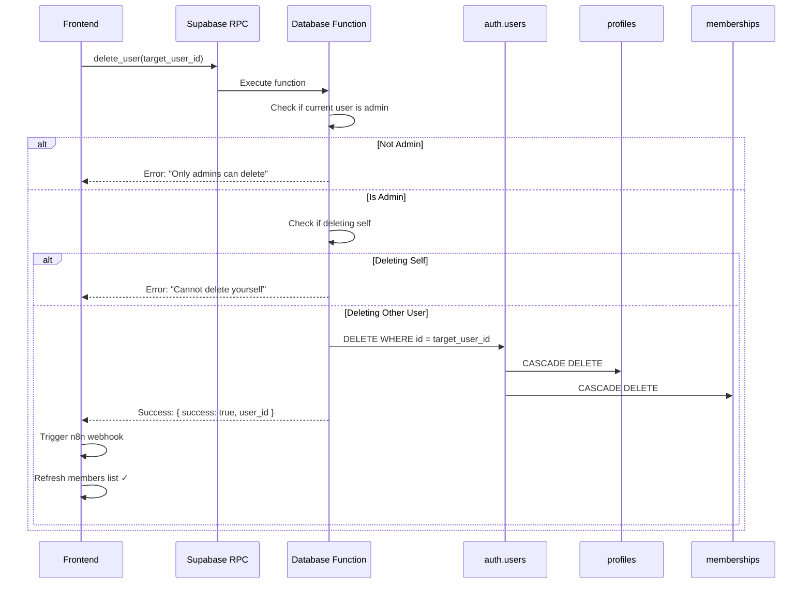

# Fix: User Deletion - "User not allowed" Error

## El Problema

Cuando intentabas eliminar un usuario, recibías este error:

```json
{
  "code": "not_admin",
  "message": "User not allowed"
}
```

### ¿Por qué ocurría?

El código frontend intentaba usar `supabase.auth.admin.deleteUser()` que requiere la **Service Role Key**. Por seguridad, solo usamos la **Anon Key** en el frontend, la cual no tiene permisos para eliminar usuarios directamente de `auth.users`.

**Problema de seguridad:**
```typescript
// ❌ NO FUNCIONA y es un riesgo de seguridad si se usara
const supabase = createClient(url, serviceRoleKey) // ¡Nunca en frontend!
await supabase.auth.admin.deleteUser(userId)
```

## La Solución

Creamos una **función de base de datos segura** que:
1. ✅ Verifica que el usuario actual es admin
2. ✅ Evita que un admin se elimine a sí mismo
3. ✅ Elimina el usuario de `auth.users` (que cascades a `profiles` y `memberships`)
4. ✅ Usa `SECURITY DEFINER` para tener privilegios elevados solo en el servidor

### Archivos Creados/Modificados

#### 1. **Nueva Migración**: `/supabase/migrations/20250107000001_add_delete_user_function.sql`

Función PostgreSQL que maneja la eliminación de forma segura:

```sql
CREATE OR REPLACE FUNCTION public.delete_user(target_user_id UUID)
RETURNS JSON AS $$
DECLARE
  current_user_role TEXT;
BEGIN
  -- Get the role of the current user
  SELECT role INTO current_user_role
  FROM public.profiles
  WHERE id = auth.uid();

  -- Check if current user is an admin
  IF current_user_role != 'admin' THEN
    RAISE EXCEPTION 'Only admins can delete users'
      USING HINT = 'not_admin';
  END IF;

  -- Prevent admins from deleting themselves
  IF target_user_id = auth.uid() THEN
    RAISE EXCEPTION 'You cannot delete yourself'
      USING HINT = 'cannot_delete_self';
  END IF;

  -- Delete from auth.users (cascades to profiles and memberships)
  DELETE FROM auth.users WHERE id = target_user_id;

  -- Return success
  RETURN json_build_object(
    'success', true,
    'user_id', target_user_id,
    'deleted_at', NOW()
  );
END;
$$ LANGUAGE plpgsql SECURITY DEFINER;
```

**Características:**
- `SECURITY DEFINER`: Ejecuta con privilegios del creador de la función, no del llamador
- Verifica rol de admin antes de proceder
- Previene auto-eliminación
- Retorna JSON con resultado de la operación

#### 2. **Frontend Actualizado**: `/frontend/src/hooks/useMembers.ts`

Ahora usa la función de base de datos en lugar de la API de admin:

```typescript
// ✅ NUEVO - Seguro y funciona
const deleteMember = useMutation({
  mutationFn: async (userId: string) => {
    // Llama a la función de base de datos
    const result = await (supabase.rpc as any)('delete_user', {
      target_user_id: userId
    })

    const data = result.data as { success: boolean; error?: string } | null
    const error = result.error

    if (error) {
      throw new Error(`Failed to delete user: ${error.message}`)
    }

    if (data && !data.success) {
      throw new Error(data.error || 'Failed to delete user')
    }

    // Trigger webhook
    await triggerN8nWebhook('member.deleted', { user_id: userId })
  },
})
```

## Cómo Aplicar la Migración

### Opción A: Supabase Local (Development)

Si estás usando Supabase localmente:

```bash
# Desde el directorio del proyecto
cd /Users/israteneda/code/jci/jci-connect

# Aplicar la migración
supabase db push
```

### Opción B: Supabase Dashboard (Production/Hosted)

1. Ve a tu proyecto en https://supabase.com
2. Navega a **SQL Editor**
3. Click en **New query**
4. Copia y pega el contenido de `/supabase/migrations/20250107000001_add_delete_user_function.sql`
5. Click en **Run** o presiona `Ctrl+Enter`
6. Verifica que dice "Success. No rows returned"

### Opción C: Supabase CLI con Proyecto Remoto

```bash
# Conectar al proyecto remoto
supabase link --project-ref your-project-ref

# Aplicar migraciones pendientes
supabase db push
```

## Verificar que Funciona

### 1. Verificar que la Función Existe

En Supabase Dashboard → SQL Editor:

```sql
-- Verificar que la función existe
SELECT 
  p.proname as function_name,
  pg_get_functiondef(p.oid) as definition
FROM pg_proc p
WHERE p.proname = 'delete_user';

-- Debe retornar 1 fila con el nombre "delete_user"
```

### 2. Probar la Eliminación

1. **Login como Admin** en tu aplicación
2. Ve a la lista de miembros
3. Click en el icono de **eliminar** (trash icon) en un miembro de prueba
4. Confirma la eliminación
5. Debe mostrar: "Member deleted successfully" ✓

### 3. Verificar en Supabase

Después de eliminar:

- **Authentication > Users**: El usuario ya no debe aparecer
- **Table Editor > profiles**: El perfil ya no debe existir
- **Table Editor > memberships**: El membership ya no debe existir

## Casos de Prueba

### ✅ Caso 1: Admin Elimina Usuario Normal

```typescript
// Login como admin
// Eliminar un member/candidate/etc.
// Resultado: Success ✓
```

### ❌ Caso 2: No-Admin Intenta Eliminar

```typescript
// Login como 'member' o 'candidate'
// Intentar eliminar cualquier usuario
// Resultado: Error "Only admins can delete users"
```

### ❌ Caso 3: Admin Intenta Auto-Eliminarse

```typescript
// Login como admin
// Intentar eliminar tu propio usuario
// Resultado: Error "You cannot delete yourself"
```

## Flujo de Eliminación



## Beneficios de Esta Solución

✅ **Seguro**: No expone Service Role Key en el frontend  
✅ **Automático**: Cascades eliminan profiles y memberships automáticamente  
✅ **Validado**: Verifica permisos de admin antes de eliminar  
✅ **Protegido**: Previene auto-eliminación accidental  
✅ **Auditable**: Retorna JSON con detalles de la operación  
✅ **Webhook**: Notifica a n8n cuando un usuario es eliminado

## Seguridad

### ¿Por qué SECURITY DEFINER?

La función usa `SECURITY DEFINER` que significa que se ejecuta con los privilegios del **creador de la función** (típicamente un superusuario), no del **usuario que la llama**.

Esto es seguro porque:
1. La función **verifica manualmente** que el usuario es admin
2. Solo usuarios autenticados pueden llamarla (`GRANT EXECUTE TO authenticated`)
3. La lógica de verificación está en el servidor, no en el cliente
4. No hay forma de bypasear las validaciones

### ¿Es esto mejor que Service Role Key en frontend?

| Aspecto | Service Role Key en Frontend | Database Function |
|---------|----------------------------|-------------------|
| **Seguridad** | ❌ Expone clave maestra | ✅ Clave segura en DB |
| **RLS** | ❌ Bypasea todo RLS | ✅ Respeta permisos |
| **Auditable** | ❌ Difícil de auditar | ✅ Todo en SQL logs |
| **Mantenible** | ❌ Lógica dispersa | ✅ Centralizada en DB |
| **Testeable** | ❌ Requiere E2E tests | ✅ Testeable con SQL |

## Troubleshooting

### Error: "function delete_user(uuid) does not exist"

**Causa**: La migración no se aplicó o falló.

**Solución**:
```sql
-- Verificar en SQL Editor
SELECT * FROM pg_proc WHERE proname = 'delete_user';

-- Si no existe, ejecutar el script de migración manualmente
```

### Error: "Only admins can delete users"

**Causa**: El usuario actual no tiene rol 'admin'.

**Solución**:
```sql
-- Verificar tu rol en SQL Editor
SELECT id, first_name, last_name, role 
FROM profiles 
WHERE id = auth.uid();

-- Si no eres admin, actualizar:
UPDATE profiles SET role = 'admin' WHERE id = 'your-user-id';
```

### Error: "You cannot delete yourself"

**Causa**: Intentas eliminar tu propia cuenta.

**Solución**: Esto es intencional para prevenir que un admin se bloquee accidentalmente. Usa otra cuenta admin o crea un nuevo admin primero.

### Usuario eliminado pero n8n no recibe webhook

**Causa**: El webhook se dispara después de eliminar, pero si hay error en n8n no se muestra.

**Solución**:
```typescript
// Ver logs en la consola del navegador
// El webhook se dispara con:
{
  event: 'member.deleted',
  data: { user_id: 'deleted-user-id' }
}
```

## Próximos Pasos (Opcionales)

### 1. Soft Deletes

En lugar de eliminar permanentemente, marcar como "deleted":

```sql
-- Agregar columna deleted_at
ALTER TABLE profiles ADD COLUMN deleted_at TIMESTAMPTZ;

-- Modificar función para soft delete
UPDATE profiles SET deleted_at = NOW() WHERE id = target_user_id;
```

### 2. Confirmación Doble

Agregar confirmación con el nombre del usuario:

```typescript
const confirmDelete = window.prompt(
  `Type "${member.first_name} ${member.last_name}" to confirm deletion`
)
if (confirmDelete !== `${member.first_name} ${member.last_name}`) {
  return
}
```

### 3. Audit Log

Registrar quién eliminó a quién:

```sql
CREATE TABLE audit_log (
  id UUID PRIMARY KEY DEFAULT uuid_generate_v4(),
  action TEXT NOT NULL,
  actor_id UUID REFERENCES auth.users(id),
  target_id UUID,
  created_at TIMESTAMPTZ DEFAULT NOW()
);

-- En la función delete_user, agregar:
INSERT INTO audit_log (action, actor_id, target_id)
VALUES ('user_deleted', auth.uid(), target_user_id);
```

---

**Fecha del Fix**: Octubre 2025  
**Versión**: 1.0  
**Estado**: ✅ Implementado y documentado

