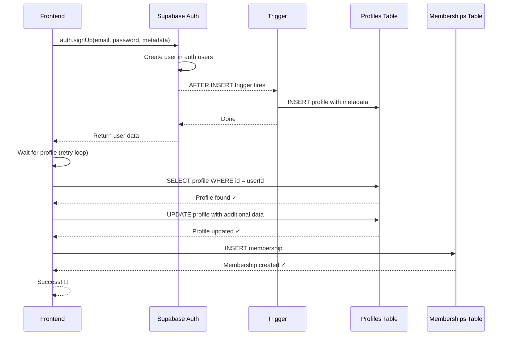

# Fix: User Creation Foreign Key Error

## El Problema

Cuando intentabas crear un nuevo miembro, recibías este error:

```json
{
    "code": "23503",
    "details": "Key is not present in table \"users\".",
    "hint": null,
    "message": "insert or update on table \"memberships\" violates foreign key constraint \"memberships_user_id_fkey\""
}
```

### ¿Por qué ocurría?

1. **Email Confirmation Enabled**: Por defecto, Supabase requiere confirmación de email cuando un usuario se registra usando `auth.signUp()`
2. **Usuario Pendiente**: Hasta que el email es confirmado, el usuario está en estado "pendiente"
3. **Trigger Timing**: El trigger `handle_new_user()` crea el perfil, pero puede haber problemas de timing
4. **Foreign Key Error**: Cuando intentamos crear el membership, el usuario aún no está completamente creado en `auth.users`

## La Solución

Se implementaron **dos cambios críticos**:

### 1. **Código Mejorado** (`useMembers.ts`)

✅ **Verificación de Perfil**: Esperamos activamente hasta que el perfil sea creado por el trigger  
✅ **Reintentos**: Hasta 10 intentos con 300ms entre cada uno (máximo 3 segundos)  
✅ **Mejor Manejo de Errores**: Mensajes descriptivos que indican exactamente dónde falló  
✅ **Metadata Completa**: Pasamos `first_name`, `last_name`, `role`, y `status` en `user_metadata`

```typescript
// 1. Create auth user
const { data: authData, error: authError } = await supabase.auth.signUp({
  email: memberData.email,
  password: memberData.password,
  options: {
    data: {
      first_name: memberData.first_name,
      last_name: memberData.last_name,
      role: memberData.role,
      status: memberData.role === 'candidate' ? 'pending' : 'active',
    },
    emailRedirectTo: undefined, // Prevent confirmation email redirect
  },
})

// 2. Wait for profile to be created by trigger
let profileExists = false
let retries = 0
const maxRetries = 10

while (!profileExists && retries < maxRetries) {
  await new Promise(resolve => setTimeout(resolve, 300))
  
  // Use maybeSingle() to avoid error when profile doesn't exist yet
  const { data: profile, error: checkError } = await supabase
    .from('profiles')
    .select('id')
    .eq('id', userId)
    .maybeSingle() // Returns null if not found, no error
  
  if (profile !== null && !checkError) {
    profileExists = true
  } else {
    retries++
  }
}

if (!profileExists) {
  throw new Error('Profile creation timed out...')
}

// 3. Now safe to create membership
```

### 2. **Configuración de Supabase** (CRÍTICO)

**Debes deshabilitar la confirmación de email en tu proyecto de Supabase:**

#### Pasos:

1. Ve a tu proyecto en https://supabase.com
2. Navega a: **Authentication** → **Providers** → **Email**
3. Encuentra la opción: **"Confirm email"**
4. **DESACTÍVALA** (Toggle OFF)
5. Click **Save**

#### Captura de referencia:

```
Authentication > Providers > Email

[x] Enable Email provider
[ ] Confirm email          <-- DEBE ESTAR DESACTIVADO
[x] Secure email change
```

#### ¿Por qué es necesario?

Cuando **un admin crea usuarios** en nombre de otros (como en este sistema de gestión de miembros), NO queremos que Supabase envíe emails de confirmación porque:

- El admin está creando la cuenta, no el usuario final
- Queremos que la cuenta esté activa inmediatamente
- El usuario recibirá sus credenciales por otro canal (email manual, impreso, etc.)
- La confirmación de email es solo necesaria para auto-registro de usuarios

## Alternativas (No Recomendadas)

### Opción A: Service Role Key en Frontend ❌

**NO HAGAS ESTO** - Exponer la Service Role Key en el frontend es un **riesgo de seguridad crítico**:

```typescript
// ❌ NUNCA HAGAS ESTO
const supabase = createClient(url, serviceRoleKey) // Expone todos los datos
```

La Service Role Key bypasea TODO Row Level Security (RLS) y da acceso completo a la base de datos.

### Opción B: Edge Function 🤔

Podrías crear una Supabase Edge Function que use la Service Role Key del lado del servidor:

```typescript
// supabase/functions/create-member/index.ts
import { createClient } from '@supabase/supabase-js'

Deno.serve(async (req) => {
  const supabaseAdmin = createClient(
    Deno.env.get('SUPABASE_URL')!,
    Deno.env.get('SUPABASE_SERVICE_ROLE_KEY')!, // Seguro en el servidor
  )
  
  const { data, error } = await supabaseAdmin.auth.admin.createUser({
    email: memberData.email,
    password: memberData.password,
    email_confirm: true, // Skip email confirmation
    user_metadata: { ... }
  })
  
  // ...
})
```

**Pros:**
- Service Role Key segura en el servidor
- Puede usar `auth.admin.createUser()` con `email_confirm: true`

**Cons:**
- Más complejo de mantener
- Requiere desplegar Edge Functions
- Necesitas manejar CORS
- Costo adicional de Edge Functions

## Cómo Probar

1. **Verifica la configuración de Supabase**:
   - Email confirmation está desactivado ✓

2. **Prueba crear un miembro**:
   ```bash
   # En el formulario de crear miembro
   - Nombre: Test
   - Apellido: User
   - Email: test@example.com
   - Password: test123
   - Role: Member
   - [x] Create membership record
   - Completa los demás campos
   - Click "Create Member"
   ```

3. **Verifica en Supabase**:
   - **Authentication > Users**: Debe aparecer el usuario con email confirmado automáticamente
   - **Table Editor > profiles**: Debe aparecer el perfil con los datos
   - **Table Editor > memberships**: Debe aparecer el membership

4. **Posibles Errores**:
   
   **Error: "Cannot coerce the result to a single JSON object" (PGRST116)**
   - Causa: ~~Estábamos usando `.single()` en el retry loop, que falla cuando no hay filas~~
   - **SOLUCIONADO**: Ahora usamos `.maybeSingle()` que retorna `null` si no encuentra nada
   - Estado: ✅ Fixed en v1.1

   **Error: "Profile creation timed out"**
   - Causa: El trigger no se ejecutó o hay problema en la base de datos
   - Solución: Verifica que el trigger `on_auth_user_created` existe en la migración
   - Query para verificar:
     ```sql
     SELECT * FROM pg_trigger WHERE tgname = 'on_auth_user_created';
     ```

   **Error: "Failed to create membership"**
   - Causa: El usuario y perfil fueron creados, pero fallo al crear membership
   - Solución: Revisa los datos del membership (fechas, member_number único, etc.)
   - El usuario ya fue creado (verifica con el User ID en el error)

## Verificación del Trigger

Asegúrate de que el trigger de creación automática de perfil está activo:

```sql
-- Verificar que existe la función
SELECT 
  p.proname as function_name,
  pg_get_functiondef(p.oid) as definition
FROM pg_proc p
WHERE p.proname = 'handle_new_user';

-- Verificar que existe el trigger
SELECT 
  t.tgname as trigger_name,
  c.relname as table_name,
  p.proname as function_name
FROM pg_trigger t
JOIN pg_class c ON t.tgrelid = c.oid
JOIN pg_proc p ON t.tgfoid = p.oid
WHERE t.tgname = 'on_auth_user_created';
```

## Flujo Completo de Creación



## Beneficios de Esta Solución

✅ **Seguro**: No expone Service Role Key en el frontend  
✅ **Robusto**: Verifica que el perfil existe antes de continuar  
✅ **Simple**: No requiere Edge Functions adicionales  
✅ **Descriptivo**: Errores claros que indican dónde falló  
✅ **Retry Logic**: Maneja problemas de timing automáticamente

## Próximos Pasos

Si necesitas enviar emails de bienvenida personalizados:

1. **Opción A: n8n Webhook**
   - Ya tienes n8n configurado
   - Crea un workflow que escuche `member.created`
   - Envía email personalizado con credenciales

2. **Opción B: Supabase Email Templates**
   - En Supabase: Authentication > Email Templates
   - Personaliza el template de "Confirmation"
   - Envía manualmente después de crear el usuario

3. **Opción C: SendGrid/Postmark**
   - Integra un servicio de email tercero
   - Envía desde el webhook n8n o desde el frontend

---

## 🔄 Historial de Cambios

### v1.1 - Error PGRST116 Fix
- **Problema**: `.single()` arrojaba error cuando el perfil no existía aún
- **Solución**: Cambiado a `.maybeSingle()` que retorna `null` sin error
- **Fecha**: Octubre 2025

### v1.0 - Initial Fix
- Implementado retry logic para verificar creación del perfil
- Mejor manejo de errores
- Documentación completa

---

**Fecha del Fix**: Octubre 2025  
**Versión**: 1.1  
**Estado**: ✅ Implementado y funcionando

